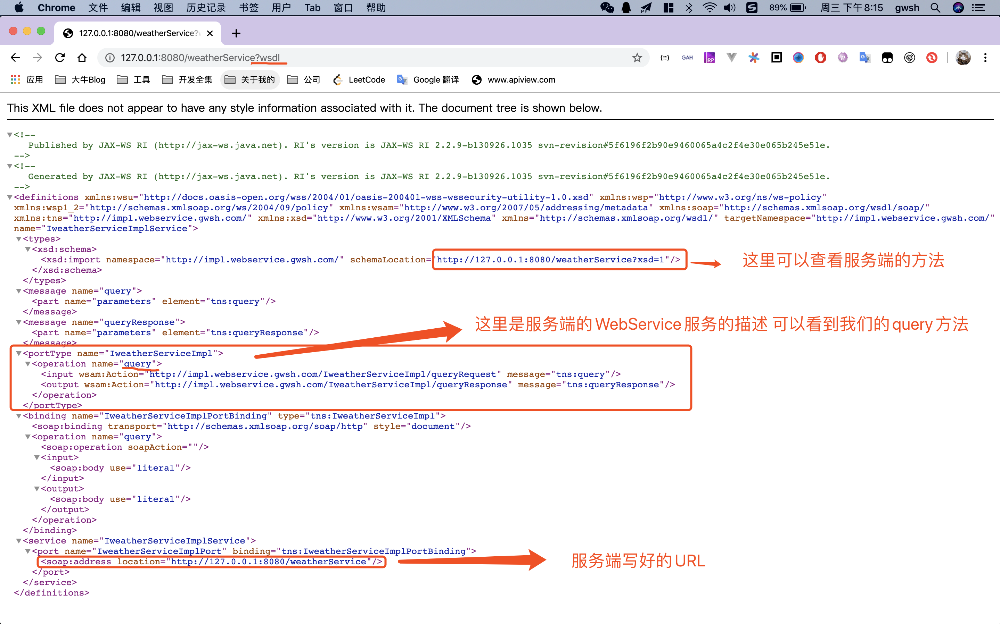
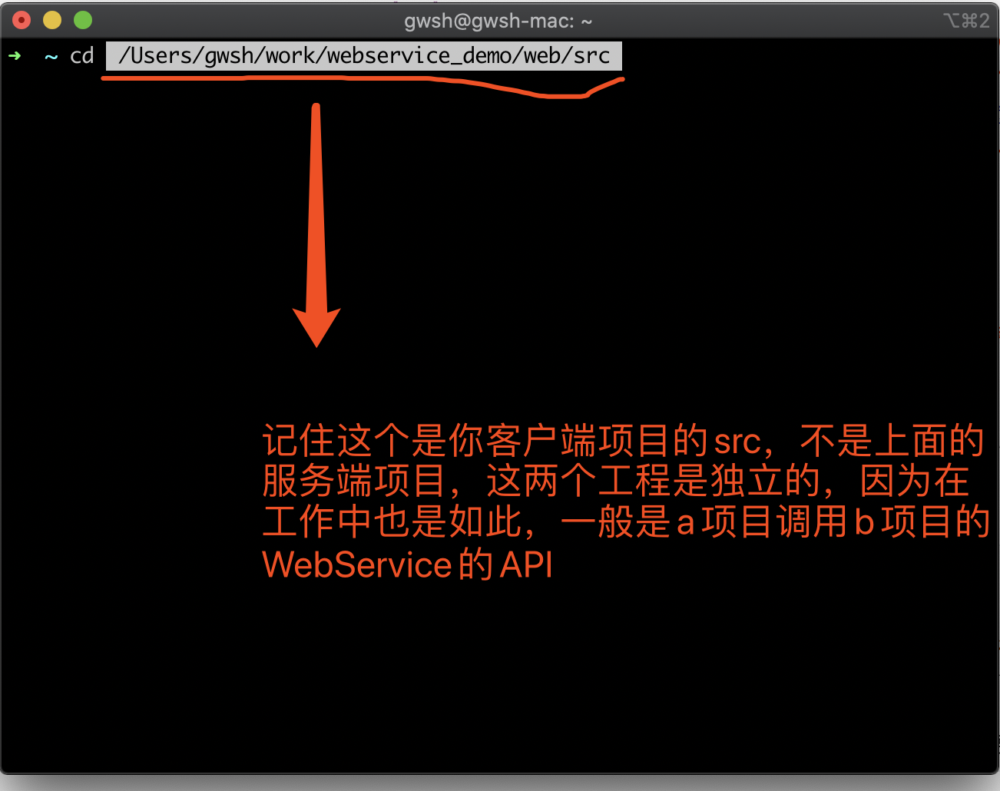

# 使用JDK 基于 B/S  实现一个 客户端调用服务端接口的 DEMO

##  <font color="#e3a">1.服务端代码编写</font>

### 1.1首先我们创建一个接口 weatherService（注：我们这个Demo、以天气接口作为案例）

<font color="red">注：服务端的代码新创建一个独立的java工程 例如名字可以叫做 webservice_service</font>

``` java
/**
 * @program webservice_server_jdk
 * @description: 天气服务的接口
 * @author: gwsh
 * @create: 2020/01/08 19:25
 */
public interface IWeatherService {
    /**
     * 查询天气接口
     * @param cityName 需要查询天气的城市名
     * @return 返回String 类型的描述
     */
    public String query(String cityName);
}

```

描述：上面的<font color="gree">**IWeatherService**</font> 接口我们模拟了一个根据城市名查询天气的一个场景

### 1.2然后我们实现上面的weatherService接口

``` java
import javax.jws.WebService;

/**
 * @program webservice_server_jdk
 * @description: 天气接口的实现
 * @author: gwsh
 * @create: 2020/01/08 19:28
 */
@WebService
public class IweatherServiceImpl implements IWeatherService {
    final static String W_0001 = "大晴天";
    final static String W_0002 = "下雨天";

    /**
     * 模拟天气数据的实现
     *
     * @param cityName 需要查询天气的城市名
     * @return
     */
    @Override
    public String query(String cityName) {
        System.err.println(cityName + "城市的天气查询中————————————star");
        String result = cityName + "天气情况是" + IweatherServiceImpl.W_0001;
        System.err.println(cityName + "城市的天气查询中————————————end");
        return result;
    }
}

```

描述：可以看出来我们实现很简单，我们的DEMO主要是教大家如何使用WebService B/S的调度

**注意：我们的weatherService实现类上面的注释**  <font color="red">@WebService</font> 注释标注这是一个WebService的服务

### 1.3 我们的业务代码已经完成了 我们发布！

虽然我们用注解的方式标注了上面的实现是一个WebService，但是这样依旧还差一步：<font color="red">发布WebService</font>

``` java
import javax.xml.ws.Endpoint;

/**
 * @program webservice_server_jdk
 * @description: 用于发布WebService服务
 * @author: gwsh
 * @create: 2020/01/08 19:33
 */
public class main {
    /**
     * 采用JDK的方式发布WebService服务
     *
     * @param args
     */
    public static void main(String[] args) {
        try {
          	// 我们通过xml.ws包中的 publish 发布服务
          	// 这个方法 有两个方法重载 我们使用其中的一个
          	// 两个参数 第一个是URL  第二个就是WebService的实例
            Endpoint.publish("http://127.0.0.1:8080/weatherService", new IweatherServiceImpl());
            System.out.println("WebService:发布成功!");
        } catch (Exception e) {
            System.err.println("发布失败：" + e.toString());
        }
    }
}
```

Run => main()   我们启动main方法，我们的WebService的服务器就算启动了！


## <font color="#e3a">2.客服端的代码篇</font>

<font color="red">**第一我们客户端编写代码的时候我们还需要做一些事情!!**</font>

<font color="red">注：服务端的代码新创建一个独立的java工程 例如名字可以叫做 webservice_client</font>

* 1.我们访问一下服务端暴露的URL（一般工作中，接口方都会基于提供改URL)
  * 1.1我们如果直接输入 http://127.0.0.1:8080/weatherService 那么必然会有问题<br>我们需要在上面的URL后面加一个参数 **wsdl**  所以我们的完整的输入如下：<br>http://127.0.0.1:8080/weatherService?wsdl<br>我们回车就会Open一个XML文件，如下图所示<br>



* 2.我们可以通过上面的XML看到许多信息，那么我们如何调用呢？操作如下

  * 2.1我们要生成客户端代码

    ``` shell
    ## 两种方式
    ## 我们都是通过 wsimport 命令生成客户端代码
    # 第一种方式【远程地址】注意 这个 . 是指当前路径 你也可以指定路径
    	wsimport -s . http://127.0.0.1:8080/weatherService?wsdl
    # 第二种方式【xml文件】
    	wsimport -s . 文件路径（注意此时如果是文件路径则不需要带参数 不需要?wsdl）
    ```

  * 2.2 我们在终端进入工程的src路径（如果是Windows电脑 cmd 进入到**webservice_client**项目的路径如下图所示

    

  * 2.3 回车之后 输入 wsimport -s . http://127.0.0.1:8080/weatherService?wsdl 就会生成代码了

* 3. 在Client工程的main方法中启动 代码如下

  ``` java
  import com.gwsh.webservice.impl.IweatherServiceImpl;
  import com.gwsh.webservice.impl.IweatherServiceImplService;
  
  /**
   * @program web
   * @description: 客服端调用服务端的WebService API
   * @author: gwsh
   * @create: 2020/01/08 21:35
   */
  public class ClientMain {
      final static String CS = "长沙";
      public static void main(String[] args) {
          // 1.创建服务视图（视图是从wsdl xml文档中的 service标签的name属性获取来的）
          IweatherServiceImplService iweatherServiceImplService = new IweatherServiceImplService();
          // 2.获取服务实现类（实现类是从wsdl xml文档中的 portType标签的name属性获取来的)
          IweatherServiceImpl iweatherService =  iweatherServiceImplService.getPort(IweatherServiceImpl.class);
          // 3.调用服务（从wsdl xml文档中的 portType标签下面的 operation标签获取的）
          String result = iweatherService.query(ClientMain.CS);
          // 4.业务处理
          System.out.println(ClientMain.CS+"："+result);
      }
  }
  
  ```


PS：具体请看本仓库的代码